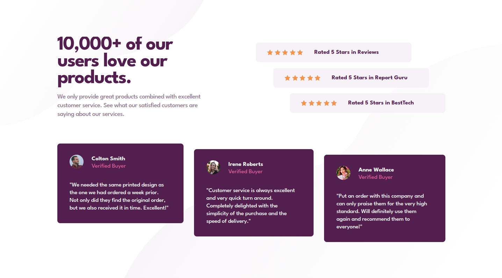
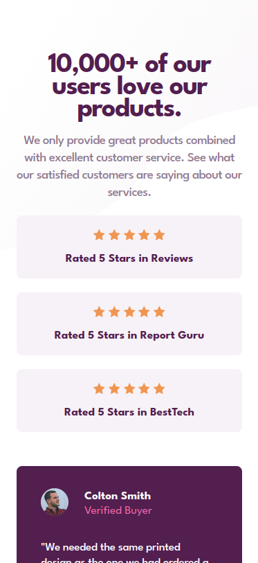

# Frontend Mentor - NFT preview card component solution

This is a solution to the [Social proof section challenge on Frontend Mentor](https://www.frontendmentor.io/challenges/social-proof-section-6e0qTv_bA). Frontend Mentor challenges help you improve your coding skills by building realistic projects. 

## Overview

### The challenge

Users should be able to:

- View the optimal layout depending on their device's screen size
- See hover states for interactive elements

### Screenshot

### Links

- Solution URL: [https://github.com/silkcoder/Social-proof-section-challenge-on-Frontend-Mentor](https://github.com/silkcoder/Social-proof-section-challenge-on-Frontend-Mentor)
- Live Site URL: [https://silkcoder.github.io/Social-proof-section-challenge-on-Frontend-Mentor/](https://silkcoder.github.io/Social-proof-section-challenge-on-Frontend-Mentor/)
